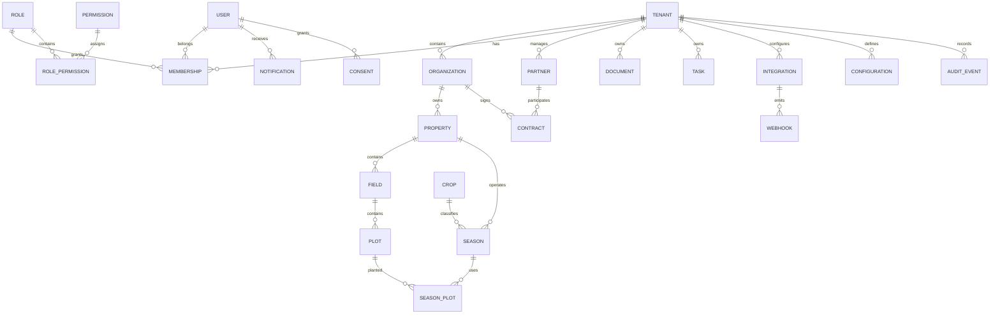

# ERD — iFarm Core

```mermaid
erDiagram
  TENANT ||--o{ ORGANIZATION : contains
  TENANT ||--o{ MEMBERSHIP : has
  USER ||--o{ MEMBERSHIP : belongs
  ROLE ||--o{ MEMBERSHIP : grants
  ROLE ||--o{ ROLE_PERMISSION : contains
  PERMISSION ||--o{ ROLE_PERMISSION : assigns
  ORGANIZATION ||--o{ PROPERTY : owns
  PROPERTY ||--o{ FIELD : contains
  FIELD ||--o{ PLOT : contains
  PROPERTY ||--o{ SEASON : operates
  CROP ||--o{ SEASON : classifies
  SEASON ||--o{ SEASON_PLOT : uses
  PLOT ||--o{ SEASON_PLOT : planted
  TENANT ||--o{ PARTNER : manages
  ORGANIZATION ||--o{ CONTRACT : signs
  PARTNER ||--o{ CONTRACT : participates
  TENANT ||--o{ DOCUMENT : owns
  TENANT ||--o{ TASK : owns
  USER ||--o{ NOTIFICATION : receives
  USER ||--o{ CONSENT : grants
  TENANT ||--o{ INTEGRATION : configures
  INTEGRATION ||--o{ WEBHOOK : emits
  TENANT ||--o{ CONFIGURATION : defines
  TENANT ||--o{ AUDIT_EVENT : records
```
